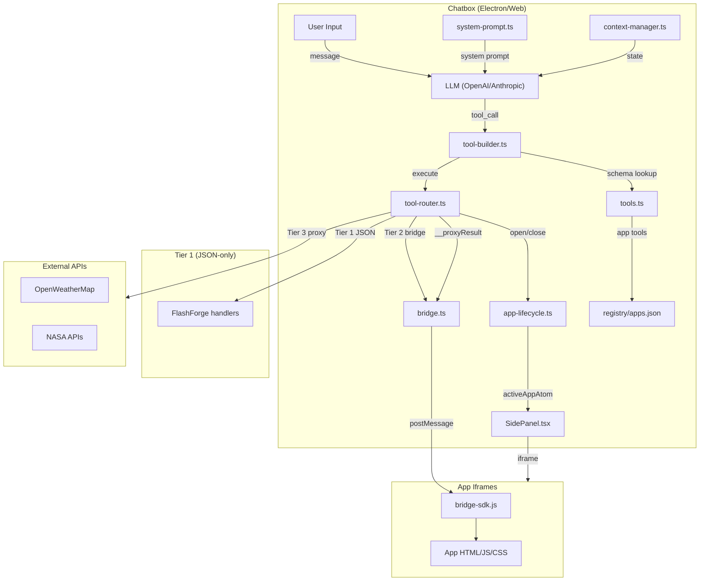

# ChatBridge Architecture Overview

This document describes the architecture of ChatBridge, an app integration subsystem for an AI chat platform (Chatbox fork). It covers the component inventory, data flow, app tiers, security model, and testing strategy.

See also: [Plugin Contract](plugin-contract.md) | [Developer Guide](developer-guide.md)

## System Diagram



## Component Inventory

| File | Role |
|------|------|
| `src/renderer/chatbridge/registry/apps.json` | App declarations: ID, tools, entrypoint, auth config |
| `src/renderer/chatbridge/registry/index.ts` | TypeScript types and registry loaders (`getEnabledApps`, `getAppById`, `generateOpenAppTool`) |
| `src/renderer/chatbridge/tools.ts` | Tool gating: returns the set of tools visible to the LLM based on active app state |
| `src/renderer/chatbridge/tool-builder.ts` | Converts JSON Schema tool definitions to Vercel AI SDK `ToolSet` with Zod schemas |
| `src/renderer/chatbridge/tool-router.ts` | Routes tool calls: `open_app`/`close_app` to lifecycle, Tier 1 to in-process handlers, Tier 3 to host proxy, Tier 2 to bridge |
| `src/renderer/chatbridge/app-lifecycle.ts` | Jotai atoms (`activeAppAtom`, `appStateAtom`) and `handleOpenApp`/`handleCloseApp` |
| `src/renderer/chatbridge/bridge.ts` | Host-side postMessage bridge: `sendMessage`, `sendToolCall`, `installMessageListener`, `clearPending` |
| `src/renderer/chatbridge/bridge-sdk.js` | App-side SDK (inlined in iframe HTML): `ChatBridge.onToolCall`, `sendStateUpdate`, `sendComplete` |
| `src/renderer/chatbridge/context-manager.ts` | Tracks app state history for LLM context |
| `src/renderer/chatbridge/system-prompt.ts` | Injects available tools and app context into the system prompt |
| `src/renderer/components/chatbridge/SidePanel.tsx` | React component: renders the iframe, handles load/error states, wires bridge lifecycle |
| `src/renderer/chatbridge/auth.ts` | OAuth2 PKCE flow for Tier 4 apps |
| `src/renderer/chatbridge/supabase.ts` | Supabase client for persistence |
| `src/renderer/chatbridge/storage.ts` | Local storage helpers |
| `src/renderer/chatbridge/token-logger.ts` | Token usage tracking |
| `src/renderer/chatbridge/messagePersistence.ts` | Message save helpers |

## Data Flow

### Standard tool call (Tier 2 -- internal iframe app)

```
User message
  -> LLM processes with system prompt (includes available tools)
  -> LLM emits tool_call (e.g. open_app { app_id: "chess" })
  -> tool-builder executes -> routeToolCall("open_app", args)
  -> handleOpenApp sets activeAppAtom
  -> SidePanel renders iframe with /apps/chess/index.html
  -> LLM emits next tool_call (e.g. start_game { color: "white" })
  -> routeToolCall -> bridge.sendToolCall(iframe, "start_game", args)
  -> iframe bridge-sdk dispatches to onToolCall handler
  -> handler returns result
  -> bridge-sdk sends tool_call_result with same message ID
  -> bridge.ts resolves pending promise
  -> routeToolCall returns JSON string to LLM
  -> LLM generates user-facing response
```

### Host-proxied tool call (Tier 3 -- external_public app)

```
LLM emits tool_call (e.g. get_weather { city: "London" })
  -> routeToolCall detects authConfig.type === "api_key"
  -> Host reads API key from import.meta.env
  -> Host calls external API via fetch()
  -> Result returned to LLM as JSON
  -> Result also forwarded to iframe as args.__proxyResult
  -> Iframe renders the pre-fetched data
```

### JSON-only tool call (Tier 1 -- no iframe)

```
LLM emits tool_call (e.g. create_deck { topic: "math", card_count: 5 })
  -> routeToolCall detects FlashForge tool
  -> handleFlashForgeTool() processes in-memory
  -> Returns JSON result directly to LLM
  -> No iframe, no bridge, no postMessage
```

## App Tiers

### Tier 1: JSON-only (no iframe)

- **`entrypoint: ""`** -- no iframe is rendered
- Tool handlers live in `tool-router.ts` as pure functions
- All state is in-memory on the host
- Example: **FlashForge** -- flashcard decks stored in a `Map`, tool calls create/study/check cards
- Best for: apps that need no UI, or where the LLM response is the entire UI

### Tier 2: Internal iframe

- **`type: "internal"`, `authConfig: null`**
- App HTML is bundled with the platform (in `src/renderer/chatbridge/apps/`)
- Iframe runs in `sandbox="allow-scripts allow-forms"` (no `allow-same-origin`)
- All logic runs in the iframe; no external API calls
- Examples: **Chess** (5 tools, game state in iframe), **contract-test** (1 echo tool)

### Tier 3: External public (host-proxied)

- **`type: "external_public"`, `authConfig.type: "api_key"`**
- The host holds the API key and proxies all external API calls
- The iframe never sees the API key and cannot make its own network requests
- The host forwards results to the iframe via `__proxyResult` for UI rendering
- Mock data fallback if the API key is missing or the request fails
- Examples: **Weather Dashboard** (OpenWeatherMap), **NASA Space Explorer** (NASA APIs)

### Tier 4: External authenticated (OAuth)

- **`type: "external_authenticated"`, `authConfig.type: "oauth2_pkce"`**
- User must authorize via OAuth2 PKCE flow
- The iframe handles API calls after receiving tokens
- Example: **Spotify Playlist Creator** (currently disabled)

## Security Model

### Iframe sandbox

All app iframes use `sandbox="allow-scripts allow-forms"`:

- **No `allow-same-origin`**: iframe origin is `null`, preventing access to host cookies, localStorage, and same-origin APIs
- **No `allow-top-navigation`**: iframe cannot navigate the parent window
- **No external resources**: all CSS/JS must be inlined in the single HTML file

### PostMessage validation

- Messages are validated by structure (`type` + `id` fields), not by origin (since sandbox iframes have `null` origin)
- Both host and iframe use `'*'` as `targetOrigin` for `postMessage()`
- Request-response correlation uses UUID v4 `id` fields
- 30-second timeout on all pending responses

### API key proxying (Tier 3)

- API keys are stored in environment variables (e.g. `VITE_WEATHER_API_KEY`)
- The host reads keys at build time via `import.meta.env`
- Keys never reach the iframe -- the host proxies all external API calls
- If the key is missing, mock data is returned (graceful degradation)

## Testing Strategy

### Unit tests (Vitest)

Located in `src/renderer/chatbridge/__tests__/` and `src/renderer/chatbridge/apps/*/__tests__/`. Run with:

```bash
pnpm test -- --testPathPattern=chatbridge
```

Coverage includes:
- `bridge.test.ts` -- postMessage send/receive, timeout, correlation
- `tool-router.test.ts` -- routing logic, FlashForge handlers, host proxy
- `tool-builder.test.ts` -- JSON Schema to Zod conversion, toolset building
- `tools.test.ts` -- tool gating (active app vs. no app)
- `app-lifecycle.test.ts` -- open/close lifecycle, atom state
- `context-manager.test.ts` -- state tracking
- `system-prompt.test.ts` -- prompt injection
- `storage.test.ts`, `auth.test.ts`, `token-logger.test.ts` -- supporting modules
- `flashforge.test.ts` -- FlashForge Tier 1 tool handlers
- `nasa-proxy.test.ts` -- NASA API proxy and mock fallback
- App-specific: `weather.test.ts`, `nasa.test.ts`

### E2E tests (Playwright)

Located in `tests/e2e/`. Run with:

```bash
npx playwright test --config=tests/e2e/playwright.config.ts
```

Test suites:
- `core-scenarios.spec.ts` -- tool discovery, open/close lifecycle, multi-app switching
- `app-flows/chess.spec.ts` -- full chess game lifecycle
- `app-flows/weather.spec.ts` -- weather query flow with mock LLM
- `app-flows/nasa.spec.ts` -- NASA API tool flows
- `resilience.spec.ts` -- error handling, timeouts, invalid tool calls

E2E tests use a **mock LLM** (`helpers/mock-llm.ts`) that returns scripted tool calls, eliminating API costs and flakiness.

## Current App Inventory

| App | Tier | Status | Tools |
|-----|------|--------|-------|
| Chess | 2 (internal iframe) | Enabled | `start_game`, `make_move`, `get_board`, `get_hint`, `resign` |
| Weather Dashboard | 3 (external public) | Enabled | `get_weather`, `get_forecast` |
| NASA Space Explorer | 3 (external public) | Enabled | `get_apod`, `get_mars_photos`, `get_asteroids` |
| FlashForge | 1 (JSON-only) | Enabled | `create_deck`, `study_card`, `check_answer`, `get_deck_stats` |
| Contract Test | 2 (internal iframe) | Enabled | `echo` |
| Spotify Playlist Creator | 4 (external auth) | Disabled | `search_tracks`, `create_playlist`, `add_to_playlist` |
| Rubik's Cube | 2 (internal iframe) | Disabled | (none) |
