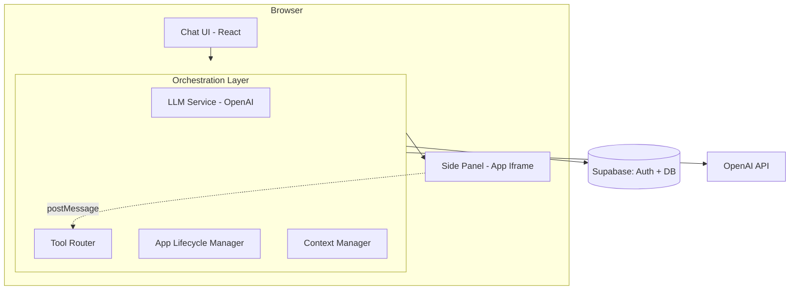

# ChatBridge Video Demo Brief

**Duration Target:** 3-5 minutes
**App URL:** http://localhost:3000 (web build)
**Model:** GPT-4o mini (default)

---

## 1. Opening (30 seconds)

### Narrator Script
"ChatBridge is an AI chat platform that lets students interact with third-party apps without leaving the conversation. Built for K-12 education on top of TutorMeAI's existing chatbot, it solves the core problem of orchestrating tool discovery, invocation, UI rendering, and state management across a unified chat experience. Today I'll walk through the platform live."

### On Screen
Title card or slide with:
- ChatBridge logo / project name
- Tagline: "AI Chat + Third-Party App Integration for K-12"
- Key stats: 3 integrated apps (Chess, Weather, Spotify), OpenAI function calling, Supabase backend

### Technical Talking Point
ChatBridge is a fork of the open-source Chatbox client, rebuilt as a web-only SPA using React + Vite. All orchestration is client-side (Architecture 1: Host-Orchestrated) with no backend server beyond Supabase for auth and persistence.

---

## 2. Architecture Slide (30 seconds)

### Narrator Script
"Here's how ChatBridge is structured. The browser hosts the Chat UI, an Orchestration Layer, and a Side Panel for app iframes. The Orchestration Layer handles LLM calls, tool routing, app lifecycle, and context management. Apps communicate through a postMessage bridge protocol with UUID-correlated envelopes and a 30-second timeout."

### On Screen
Mermaid architecture diagram:

### Technical Talking Point
Dynamic tool scoping keeps token costs low: with no app active, the LLM sees only the `open_app` meta-tool. When an app opens, its specific tools are injected. When it closes, they are removed. This avoids the token bloat of loading all tool schemas at once.

---

## 3. Live Demo

### Step 1: App Load (15 seconds)

**Narrator Script:**
"When the app loads, you see the main chat interface. On the left is the sidebar with conversation history, a New Chat button, and navigation to Settings. The main area shows a welcome prompt with the message input at the bottom. Notice the model selector in the bottom-right showing GPT-4o mini, our default model optimized for cost."

**What's Visible on Screen:**
[Screenshot: Home screen with sidebar showing conversation history (starred copilots at top, recent chats below), center area with chat bubble icon and "What can I help you with today?" prompt, bottom input bar with "Type your question here..." placeholder, model selector showing "GPT-4o mini", token counter at 0, and "Welcome to Chatbox!" login banner]

**Technical Talking Point:**
The app persists all conversations to Supabase with Row Level Security, so each user only sees their own chats. The token counter in the bottom bar tracks cumulative usage per conversation, which feeds into the `token_usage_log` table for cost analysis.

---

### Step 2: New Chat + Weather Query (30 seconds)

**Narrator Script:**
"I'll start a new chat and ask about the weather. When I type 'what's the weather in New York?', ChatBridge recognizes this as a tool-worthy query. The LLM calls `open_app` to launch the Weather app, then invokes `get_weather` with the city parameter. You can see the tool call badge appear with a checkmark when it completes, and the side panel opens on the right."

**What's Visible on Screen:**
[Screenshot: Chat showing user message "what's the weather in new york?", assistant response with `get_weather` tool call badge (green checkmark), weather details including temperature (72 degrees F, partly cloudy), humidity (55%), wind speed (12 mph), and atmospheric pressure (1015 hPa). Token count shows ~1048 tokens. Side panel visible on right with weather app status.]

**Technical Talking Point:**
The `get_weather` tool is defined in the app registry's JSON config. When invoked, the Tool Router dispatches a postMessage to the Weather app's sandboxed iframe. The app calls the OpenWeatherMap API (key passed securely via `app_init`, never embedded in the iframe HTML) and returns structured data. The LLM then formats it conversationally.

---

### Step 3: Follow-up Query (30 seconds)

**Narrator Script:**
"Now watch context retention in action. I simply ask 'how about in Tokyo?' and ChatBridge understands from the conversation context that I'm asking about weather. It reuses the same `get_weather` tool without needing me to specify the app again. The Weather app in the side panel stays active."

**What's Visible on Screen:**
[Screenshot: Full conversation showing the New York weather response, followed by user message "how about in Tokyo?", another `get_weather` tool call badge with checkmark, and Tokyo weather response (68 degrees F, clear, 62% humidity, 8 mph wind). Token count grows to ~1406. Side panel remains open on right showing "Idle" status. Chat area narrows to accommodate the panel.]

**Technical Talking Point:**
This demonstrates dynamic tool scoping: because the Weather app is already active, its tools (`get_weather`, `get_forecast`) remain in the LLM's context. The Context Manager injects the current app state into the system prompt, so the LLM knows which app is active and can invoke its tools directly without calling `open_app` again. Multi-city queries work naturally through conversation history.

---

### Step 4: Chess App (30 seconds)

**Narrator Script:**
"Now I'll switch contexts entirely. When I say 'let's play chess', ChatBridge calls the `open_app` meta-tool to switch from Weather to Chess, then invokes `start_game` to initialize the board. You can see multiple tool call badges as the orchestration layer sequences the app switch: first `start_game`, then `open_app` to load the chess iframe, then `start_game` again in the new app context."

**What's Visible on Screen:**
[Screenshot: Chat showing user message "let's play chess" followed by multiple tool call badges -- `start_game` (checkmark), `open_app` (checkmark), `start_game` (checkmark). The LLM provides a conversational response about starting the chess game. Side panel shows the chess app context. Token count reaches ~280.]

**Technical Talking Point:**
App switching demonstrates the full lifecycle: the Weather app's state is serialized and stored as an `app_context` message in the conversation, its tools are removed from the LLM context, the Chess app's iframe is mounted in the side panel, and Chess-specific tools (`start_game`, `make_move`, `get_board`, `get_hint`, `resign`) are injected. The `sandbox="allow-scripts allow-forms"` attribute on the iframe prevents the Chess app from accessing the parent DOM or host-origin storage.

---

### Step 5: Settings (15 seconds)

**Narrator Script:**
"Finally, the Settings page. Clicking Settings in the sidebar opens the configuration panel where you can select your AI model -- we default to GPT-4o mini for cost efficiency, but GPT-4o and other providers are available. This is also where teachers or admins would configure their OpenAI API key."

**What's Visible on Screen:**
[Screenshot: Settings overlay/modal showing "Welcome to Chatbox AI" header, a "Login" button for Chatbox AI account, "Model" section with available models listed including Chatbox AI options, Gemini 3.1 Pro, GPT-5, GPT-4o, and others. Model selection dropdowns and configuration options visible. Default Model section at top.]

**Technical Talking Point:**
The LLM Service is provider-agnostic by design. MVP uses OpenAI for its mature function calling support, but the architecture supports swapping in Anthropic Claude or other providers via Chatbox's existing multi-provider infrastructure. The API key is stored locally and never sent to our backend -- all LLM calls go directly from the browser to OpenAI.

---

## 4. Cost Analysis (30 seconds)

### Narrator Script
"One of ChatBridge's strengths is its cost profile. Using GPT-4o mini, a single classroom of 30 students costs about $2 per month. Even a school-wide deployment of 600 students is only around $36 per month for API costs, plus $25 for Supabase Pro if needed. The free tiers of Supabase and Vercel/Netlify cover pilot deployments with zero hosting cost."

### On Screen
Cost summary table:

| Scale | Students | Queries/Month | LLM Cost/Month | Total/Month |
|-------|----------|---------------|-----------------|-------------|
| Pilot (1 class) | 30 | 3,000 | ~$2 | ~$2 |
| Grade level (5 classes) | 150 | 15,000 | ~$9 | ~$9 |
| School-wide (20 classes) | 600 | 60,000 | ~$36 | ~$75 |
| District (10 schools) | 6,000 | 600,000 | ~$360 | ~$400 |

**Assumptions:** 5 queries/student/day, 20 school days/month, ~2,000 input + 500 output tokens per query (blended average). GPT-4o mini pricing: $0.15/1M input, $0.60/1M output.

### Technical Talking Point
Key cost optimizations: prompt caching (the ~700-token system prompt baseline is identical across requests, eligible for OpenAI's automatic 50% caching discount), tool result caching (weather data cached for 15-30 minutes since classmates query the same locations), and dynamic tool scoping (fewer tokens per request vs. loading all tool schemas).

---

## 5. Post-MVP Roadmap (30 seconds)

### Narrator Script
"Looking ahead, three priorities for post-MVP. First, streaming responses -- the MVP waits for complete LLM responses before rendering, but streaming would cut perceived latency to near-zero. Second, inline app rendering -- instead of only a side panel, apps could appear as interactive cards directly in the message stream. Third, server-side orchestration -- moving LLM calls to Supabase Edge Functions keeps API keys off the client and enables server-side audit trails."

### On Screen
Top 3 Post-MVP items:

1. **Streaming UX** -- Progressive token rendering via SSE, typing indicators, skeleton loading states in the side panel. Reduces perceived TTFT from seconds to milliseconds.

2. **Inline + Expand Rendering** -- App thumbnails embedded in the message stream with "expand to panel" button. Same iframe, reparented between inline and panel DOM positions.

3. **Server-Side Orchestration** -- Move LLM calls to Supabase Edge Functions (Architecture 3 hybrid). API keys never in client, server-side token tracking, full audit trail.

### Technical Talking Point
Additional post-MVP items include: embedding-based tool relevance scoring (auto-detect which app to invoke from natural language without explicit requests), Langfuse observability integration, a developer SDK published on npm, and Playwright E2E test suites replacing the manual Chrome MCP tests used in MVP.

---

## 6. Q&A Prep

### Q1: How do you prevent a malicious third-party app from accessing student data?

**Answer:** Three layers of defense. First, iframe sandboxing with `sandbox="allow-scripts allow-forms"` -- critically, `allow-same-origin` is omitted, so apps cannot access the host's DOM, localStorage, cookies, or IndexedDB. Second, all app-host communication goes through postMessage with origin validation on both sides and UUID-correlated request/response envelopes. Third, OAuth tokens and API keys are never stored in the iframe -- they are passed via postMessage and held in memory only, preventing persistence or exfiltration.

### Q2: Why client-side orchestration instead of a backend server?

**Answer:** For MVP, client-side orchestration (Architecture 1) was chosen because it matches Chatbox's existing patterns and eliminates a backend deployment step. The trade-off is that the OpenAI API key lives in the browser. For production, the planned migration to Supabase Edge Functions (Architecture 3) moves the API key server-side while keeping the same Tool Router and App Lifecycle Manager interfaces -- the LLM Service module is isolated so the swap requires no changes to the rest of the orchestration layer.

### Q3: How does the token cost scale if students have long conversations?

**Answer:** The biggest cost driver is conversation history accumulating in the context window. Mitigation strategies include: a sliding window keeping only the last N messages in context, summarization of older messages into ~200-token digests, and session isolation per topic or class period. These can reduce input tokens by 40-60% for longer sessions. Additionally, OpenAI's prompt caching gives an automatic 50% discount on the ~700-token system prompt baseline that is identical across all requests.

### Q4: What happens if an app crashes or hangs mid-interaction?

**Answer:** The bridge protocol has a 30-second timeout per tool invocation. If the app doesn't respond within 5 seconds, the host sends one retry with the same UUID (apps must be idempotent). If still no response by 30 seconds, the host treats it as a timeout error: the side panel closes, error context is injected into the conversation, and the LLM continues conversationally (e.g., "the chess app encountered an issue, let me know if you'd like to try again"). The last-known app state is serialized and stored so the app can resume later.

### Q5: Why did you choose these three apps (Chess, Weather, Spotify)?

**Answer:** Each app demonstrates a different integration pattern required by the brief. Chess is internal (no auth, bundled HTML) with complex bidirectional state and the most demanding lifecycle -- start, move, hint, resign, resume. Weather is external-public (API key auth, no user auth) with simple request-response tools, demonstrating the simplest integration path. Spotify is external-authenticated (OAuth 2.0 PKCE) requiring a popup auth flow, token storage, and refresh -- demonstrating the full auth lifecycle. Together they cover all three app type categories specified in the requirements.

---

## Recording Notes

- **Browser:** Chrome, dark mode theme active
- **Resolution:** Target 1920x1080 for recording (current viewport ~1117x871)
- **Model selector:** Ensure "GPT-4o mini" is visible in bottom-right corner throughout demo
- **Side panel:** Opens automatically when tool calls invoke an app; closes with X button
- **Token counter:** Visible in bottom bar, increments with each message -- good to call out during recording
- **Pace:** Allow 5-10 seconds after sending each message for the LLM to respond and tool calls to complete before narrating the result
